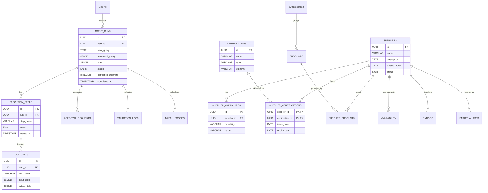

# NexusAI ER Diagram

This document illustrates the Entity-Relationship (ER) model for the NexusAI platform, designed around the Agent Lifecycle and strict deterministic validation.

```mermaid
erDiagram
    %% AGENT SCHEMA
    USERS ||--o{ AGENT_RUNS : "initiates"
    AGENT_RUNS ||--o{ EXECUTION_STEPS : "has"
    EXECUTION_STEPS ||--o{ TOOL_CALLS : "invokes"
    AGENT_RUNS ||--o{ APPROVAL_REQUESTS : "generates"
    AGENT_RUNS ||--o{ VALIDATION_LOGS : "validates"
    AGENT_RUNS ||--o{ MATCH_SCORES : "calculates"

    %% BUSINESS SCHEMA
    SUPPLIERS ||--o{ SUPPLIER_CAPABILITIES : "has"
    SUPPLIERS ||--o{ SUPPLIER_CERTIFICATIONS : "holds"
    CERTIFICATIONS ||--o{ SUPPLIER_CERTIFICATIONS : "awarded_to"
    SUPPLIERS ||--o{ SUPPLIER_PRODUCTS : "offers"
    PRODUCTS ||--o{ SUPPLIER_PRODUCTS : "provided_by"
    CATEGORIES ||--o{ PRODUCTS : "groups"
    
    %% POLYMORPHIC RELATIONSHIPS (Implied)
    SUPPLIERS ||--o{ AVAILABILITY : "has_capacity"
    SUPPLIERS ||--o{ RATINGS : "receives"
    SUPPLIERS ||--o{ ENTITY_ALIASES : "known_as"
    
    %% TABLE DEFINITIONS
    AGENT_RUNS {
        UUID id PK
        UUID user_id FK
        TEXT user_query
        JSONB structured_query
        JSONB plan
        Enum status
        INTEGER correction_attempts
        TIMESTAMP completed_at
    }

    EXECUTION_STEPS {
        UUID id PK
        UUID run_id FK
        VARCHAR step_name
        Enum status
        TIMESTAMP started_at
    }

    TOOL_CALLS {
        UUID id PK
        UUID step_id FK
        VARCHAR tool_name
        JSONB input_args
        JSONB output_data
    }

    SUPPLIERS {
        UUID id PK
        VARCHAR name
        TEXT description
        TEXT trusted_notes
        Enum status
    }

    SUPPLIER_CAPABILITIES {
        UUID id PK
        UUID supplier_id FK
        VARCHAR capability
        VARCHAR value
    }

    CERTIFICATIONS {
        UUID id PK
        VARCHAR name
        VARCHAR type
        VARCHAR authority
    }

    SUPPLIER_CERTIFICATIONS {
        UUID supplier_id PK,FK
        UUID certification_id PK,FK
        DATE issue_date
        DATE expiry_date
    }
```
